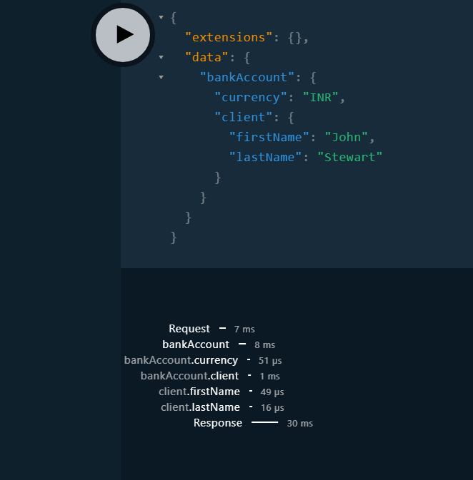

= GraphQL Java
Ayman Patel
:toc:
:icons: font

== GraphQL Best practices

=== DDOS
1. Attack
image:img/1.DDOSAttackProblem.jpg[]


2. Solution


Set `max-query-depth` in `application.yml`

```yml
graphql:
    max-query-depth: 3
```

image:img/1.DDOSAttackSolution.jpg[]


=== Playground

> DO NOT ENABLE Playground for Prod.


== GraphQL Java


==== `GraphQLResolver` vs `GraphQLQueryResolver<DataClassName>`

WARNING: I still can't grasp the difference and there is not official doc for these Classes!

=== Exception Handling

==== Default GraphQL Exception Handler

`DefaultGraphQLErrorHandler.processErrors` is called for any `Runtime.class` or `GraphQLException.class` is called (thrown by `ThrowableGraphQLError`)

This project has common `GraphQLExceptionHandler` with 2 methods

1. `ThrowableGraphQLError handle(GraphQLException graphQLException)`

- For Client side errors (Giving MORE info about Client error)

2. `ThrowableGraphQLError handle(RuntimeException graphQLException)`

- For Server side errors (Giving NO info about Server error)


==== Custom GraphQL ErrorHandler

> Can extend `GraphQLErrorHandler` for custom exception handling.

- Defined in `exception.CustomGraphQLErrorHandler`

- `CustomGraphQLErrorHandler.processErrors` is called instead of `DefaultGraphQLErrorHandler.processErrors`


=== `DataFetcherResult`

Contains both data, errors and local context  to be sent as final result to graphql server.


=== Mutation

> Write operations


==== Upload file

Use `DataFetchingEnvironment` and `DefaultGraphQLServletContext` from the GraphQL Servers


```curl
curl --location --request POST 'http://localhost:8080/graphql' \
--form 'operations="{\"query\":\"mutation {uploadFile}\" , \"variables\":{}}"' \
--form 'file=@"/D:/Coding/learngraphql-java/README.adoc"' // Remem  ber this is of type File. CURL import on postman will fail this command

// "{"query":"mutation {uploadFile}" , "variables":{}}"
```


== DataFetchingEnviroment

https://www.graphql-java.com/documentation/v11/data-fetching/[Documentation]

> Powerful object with useful methods for GraphQL interceptors


1. `getSelectionSet` Useful for DB layer
2. `getContext`: Useful for Auth
etc


== Scalars


GraphQL spec includes default scalar types `Int`, `Float`, `String`, `Boolean`, and `ID`. Some applications need to support other atomic data types (such as `Date`) or add validation to an existing type(`NonNegativeInteger`)

To enable this

1. Define custom scalar types. https://www.apollographql.com/docs/apollo-server/schema/custom-scalars/[Apollo Doc]

2. Use library. https://github.com/graphql-java/graphql-java-extended-scalars[Java GraphQL Scalar]

=== Steps to use custom Scalar

1. Add `scalar <ScalarName>` in `.graphqls` or any GrpahQL file.
2. For Java, create a Bean. Example
+
----
@Bean
public GraphQLScalarType nonNegativeInt() {
    return ExtendedScalars.NonNegativeInt;
}
----

- TODO: Typescript

3.


== `GraphQLServletListener`

Interfaces for request states.

1. `onRequest`
2. `RequestCallback`
    - `onRequest`
    - `onSuccess`
    - `onFinally`


== Pagination

> https://graphql.org/learn/pagination/[GraphQL docs]

```javascript
// GET Bank Accounts Pagination
query GET_BANK_ACCOUNTS{
    bankAccounts(first: 5, after: "<uuid>") {
        edges {
            cursor // uuid
            node {
                id
            }
        }
        pageInfo {
            hasPreviousPage
            hasNextPage
            startCursor
            endCursor
        }
    }
}
```

Response:

```javascript
{
  "data": {
    "bankAccounts": {
      "edges": [
        {
          "cursor": "NDEwZjU5MTktZTUwYi00NzkwLWFhZTMtNjVkMmQ0YjIxYzc3",
          "node": {
            "id": "410f5919-e50b-4790-aae3-65d2d4b21c77"
          }
        },
        {
          "cursor": "NDhlNGE0ODQtYWYyYy00MzY2LThjZDQtMjUzMzA1OTc0NzNm",
          "node": {
            "id": "48e4a484-af2c-4366-8cd4-25330597473f"
          }
        }
      ],
      "pageInfo": {
        "hasPreviousPage": true,
        "hasNextPage": false,
        "startCursor": "NDEwZjU5MTktZTUwYi00NzkwLWFhZTMtNjVkMmQ0YjIxYzc3",
        "endCursor": "NDhlNGE0ODQtYWYyYy00MzY2LThjZDQtMjUzMzA1OTc0NzNm"
      }
    }
  }
}
```

Usually pagination is offset-based.
ID-based based pagination uses unique identifier which is more reliable than offset-based.

== Custom Context

We have custom context so that we can intercept network request and get info such as header from `HttpServletRequest` from `GraphQLServletContext`

We used `GraphQLServletContext` in junction with `GraphQLServletContextBuilder` to get Context info.

NOTE: `user_id` is the header name given in HTTP Headers in GraphQL playground.

== N+1 Problem


== Instrumentation and Tracing


> Ability to GraphQL query and when it is executing in server, provide instrument data (log data; tracing) during execution of query.


=== Tracing


`application.properties`

- `graphql.servolet.tracing-enabled=true` Get tracing info on RH corner




== Data Loader

Very important.

WARNING: Please read this https://github.com/graphql-java/java-dataloader[Github Java Dataloader] doc
