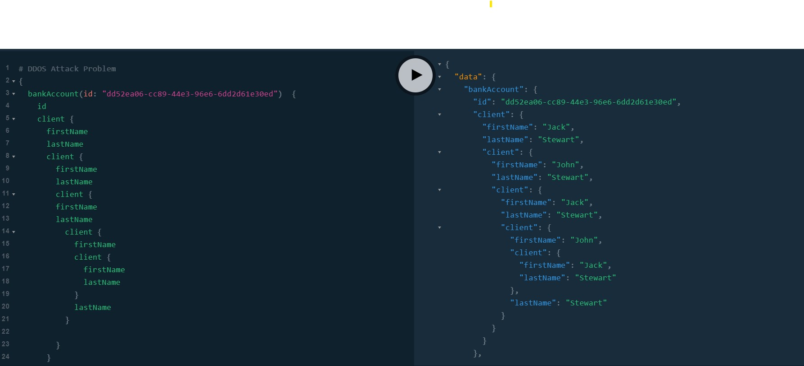
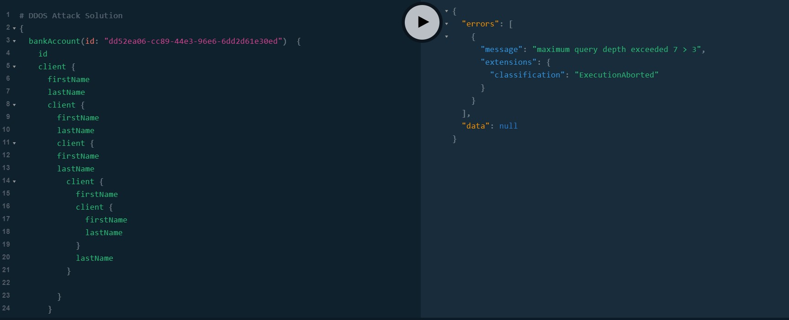

= GraphQL Java
Ayman Patel
:toc:
:icons: font

== GraphQL Best practices

=== DDOS
1. Attack



2. Solution


Set `max-query-depth` in `application.yml`

```yml
graphql:
    max-query-depth: 3
```




=== Playground

> DO NOT ENABLE Playground for Prod.


== GraphQL Java


==== `GraphQLResolver` vs `GraphQLQueryResolver<DataClassName>`

WARNING: I still can't grasp the difference and there is not official doc for these Classes!

=== Exception Handling

==== Default GraphQL Exception Handler

`DefaultGraphQLErrorHandler.processErrors` is called for any `Runtime.class` or `GraphQLException.class` is called (thrown by `ThrowableGraphQLError`)

This project has common `GraphQLExceptionHandler` with 2 methods

1. `ThrowableGraphQLError handle(GraphQLException graphQLException)`

- For Client side errors (Giving MORE info about Client error)

2. `ThrowableGraphQLError handle(RuntimeException graphQLException)`

- For Server side errors (Giving NO info about Server error)


==== Custom GraphQL ErrorHandler

> Can extend `GraphQLErrorHandler` for custom exception handling.

- Defined in `exception.CustomGraphQLErrorHandler`

- `CustomGraphQLErrorHandler.processErrors` is called instead of `DefaultGraphQLErrorHandler.processErrors`


=== `DataFetcherResult`

Contains both data, errors and local context  to be sent as final result to graphql server.


=== Mutation

> Write operations


==== Upload file

Use `DataFetchingEnvironment` and `DefaultGraphQLServletContext` from the GraphQL Servers


```curl
curl --location --request POST 'http://localhost:8080/graphql' \
--form 'operations="{\"query\":\"mutation {uploadFile}\" , \"variables\":{}}"' \
--form 'file=@"/D:/Coding/learngraphql-java/README.adoc"' // Remem  ber this is of type File. CURL import on postman will fail this command

// "{"query":"mutation {uploadFile}" , "variables":{}}"
```


== DataFetchingEnviroment

https://www.graphql-java.com/documentation/v11/data-fetching/[Documentation]

> Powerful object with useful methods for GraphQL interceptors


1. `getSelectionSet` Useful for DB layer
2. `getContext`: Useful for Auth
etc
